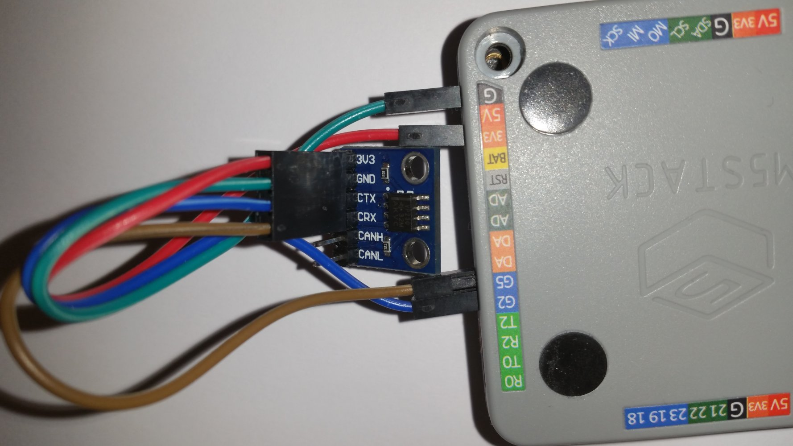

# M5Stack-NMEA-2000-Display-CAN-BUS

This repository shows how to use the M5Stack as NMEA 2000 Display (and WiFi Gateway). 
The M5Stack is receiving the data directly from the CAN bus.

The project requires the NMEA2000, NMEA2000_esp32 and NMEA0183 libraries from Timo Lappalainen: https://github.com/ttlappalainen
and the M5StackUpdater from: https://github.com/tobozo/M5Stack-SD-Updater.git
This is a fork from: https://github.com/AK-Homberger/M5Stack-NMEA-2000-Display-CAN-BUS

It is build with VScode platformio Arduino.

(The M5Stack can also work as WiFi Gateway to send NMEA 0183 messsages (TCP port 2222) via WiFi.
Just set ENABLE_WIFI to "1" to enable. Change SSID/password accordingly.)

The only external hardware is the 3.3V CAN bus transceiver (SN65HVD230).
It is connected to 3,3 V, GND, CAN TX (GPIO2) CAN RX (GPIO 5).

With the left two buttons you can flip through the pages (6 pages currently) with differnt NMEA 2000 data. The right button is changing the backlight of the LCD.(long click will change direction)

###Optional

Optional the LovyanLauncher (https://github.com/lovyan03/M5Stack_LovyanLauncher) can be used. 
Please look at the youtube videos to get information of the LovyanLauncher.

The LovyanLauncher uses the sd card.
There can be more programs on the SD. So you can switch between differnet NMEA2000 apps and CANBUS apps or ...
After LovyanLauncher is installed. 
Copy the compiled bin file .bin/build/m5stack-grey/firmware.bin into the root path of the LovyanLauncher SD (rename it to N2Kdisplay.bin).
To get pictures in the LovyanLauncher menu copy the files from the LovyanLauncher folder of the project to the SD.
(To simply copy the files to the SD use winscp and the LovyanLauncher -> Tools -> FTP Server (SDcard))
